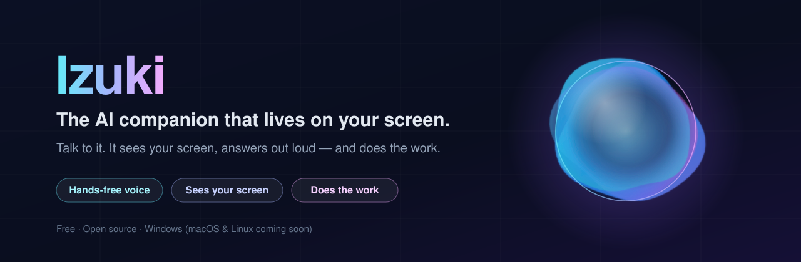

<div align="center">



# Izuki — the AI companion that lives on your Windows screen

**Talk to it. It sees your screen, answers you out loud, and uses your mouse and keyboard to get things done.**

Free · Open source · Hands-free voice · Works with free AI keys

[**⬇ Download for Windows**](https://github.com/nova-izuki/izuki/releases/latest) ·
[🌐 Website — try it in your browser](https://nova-izuki.github.io/izuki/#try) ·
[📱 Phone app](https://nova-izuki.github.io/izuki/app/) ·
[How to use it](#how-to-use-it) ·
[Support the builder ☕](#-support-the-builder)

*macOS and Linux versions are coming soon.*

**Follow Izuki — @izukiapp everywhere:**
[X](https://x.com/izukiapp) ·
[Instagram](https://www.instagram.com/izukiapp) ·
[TikTok](https://www.tiktok.com/@izukiapp) ·
[YouTube](https://www.youtube.com/@izukiapp) ·
[LinkedIn](https://www.linkedin.com/company/143922746/) ·
[All links](https://nova-izuki.github.io/izuki/links/)

</div>

---

Say your wake word — like **“Hey Nova”**. A glowing liquid orb
appears, Izuki says “Mhm?”, and you just talk — like a voice call with a friend who
happens to be great with computers. It can:

- **Answer questions about what's on your screen** — “what does this error mean?”, “summarise this page”.
- **Do things for you** — “open Spotify and play something chill”, “reply to this email saying I'll be late”.
  It looks, acts, looks again, and keeps going until the job is done.
- **Point things out** — “where's the export button?” and it circles it on your screen while it explains.
- **Ask you when it's unsure** — “Which account? Circle it for me.” Circle it, press Enter, and it carries on.
- **Check with you before anything final** — submitting, sending, buying or deleting always waits for your OK.
- **Remember you** — your name, your preferences, the habits it notices. You can see and delete every memory.
- **Tap you on the shoulder** — an important email, a meeting in 15 minutes, homework due tomorrow, a morning brief.
- **Look things up for you** — it searches the web and reads the pages itself, quietly, even sites you're signed in to.
- **Do everyday things instantly** — “scroll down”, “louder”, “pause”, “next song”, “go back”, “new tab”: done at once, no AI, like Siri.
- **Work with any AI, even small free ones** — they get a simple menu (Easy Mode) and Izuki finds the real button by name, so they act instead of explaining.
- **Stop the instant you say so** — **Esc** or **Ctrl+Shift+Q**, any time, in every mode.

<!-- Screenshots / demo: drop a GIF or MP4 of Izuki in action into docs/ and link it here, e.g.
<p align="center"></p> -->

## Features

New in **1.0.14**: repaired account routing, Mouse/Precision controls, three matching orb styles, recoverable flow cleanup, Discord delivery checks, and a video classroom. [Release details and test steps](docs/RELEASE-1.0.14.md).

| | |
|---|---|
| 🎙️ **Hands-free voice** | Wake word runs on your PC (no audio leaves it until you talk to Izuki). Live transcript of your words, a voice-reactive orb, and you can **talk over Izuki to interrupt it** — like ChatGPT's voice mode. |
| 🗣️ **A natural voice** | Lifelike free neural voices that pause at commas and full stops like a person — no key needed. Or a voice that runs on your own PC, offline (Kokoro), Groq's expressive Orpheus (free key), Google's Gemini voice (free with your Gemini key), Azure Speech (the same Natural voices through Microsoft's official free plan), ElevenLabs (the most human voices, free monthly allowance), or ChatGPT's voice (needs a little OpenAI credit). |
| 🎭 **30+ characters** | Pick who Izuki is: warm Nova, deep calm Leo, British Sophie, Nigerian Ezinne, Naija Pidgin Chidi, Spanish Lucía, French, Swahili, Hindi, a hype coach, a butler, a pirate — or **Rex**, unfiltered and sarcastic (it swears and roasts you, only if you pick it). Rename it, pick any of 50+ voices, change speed and pitch, and give it your own personality. It talks that way everywhere — voice, chat, phone and Telegram. |
| 👀 **Sees your screen** | Understands screenshots *and* the real buttons/fields Windows reports, so clicks land on the right control. |
| 🔁 **Look → act → look again** | Multi-step tasks keep going across new windows, pages and pop-ups until the job is visibly done. |
| 🚀 **Instant commands** | "Scroll down", "louder", "quieter", "pause", "play", "next song", "go back", "refresh", "new tab", "close tab", "minimise this", "show desktop", "zoom in", "undo", "save" — done at once with no AI, so there's nothing to wait for and nothing to get wrong. Works by voice, typing, and from your phone. |
| 🎯 **Safe Hands (accurate clicks)** | Every click is checked in a few milliseconds before it happens: is the button really under the pointer (pages move as ads and pictures load — then it clicks where the button is *now*), is it greyed out, is another window on top of it (then it presses the button directly through Windows, or clears the cover first), and after typing it reads the box back and fixes a wrong letter. It clicks the visible part of a half-hidden link, places the pointer exactly on any monitor, and its own orb never catches the click. Say "click Subscribe" or "press Sign in" and it's clicked instantly, no AI needed. Built on Microsoft's UFO² research and Anthropic's computer-use guidance. |
| 🐞 **Bug catcher** | Izuki keeps a log of what it does (`%APPDATA%\Izuki\logs\izuki.log`) and reports crashes and errors by itself — from the PC app, the phone app, the phone call page and the website — so bugs get fixed without you having to describe them. API keys, emails, phone numbers and your Windows user name are removed first, and it never sends screenshots, recordings or chats. **Settings → Something wrong?** sends a report in one tap, or switch automatic reports off. Where reports go is set in [`docs/bugs.json`](docs/bugs.json). |
| 🧩 **Works with any AI** | Big models (Gemini, GPT, Claude, Grok) get the full playbook. Small and free ones (Llama, Gemma, Qwen, Mistral Small, local models) get **Easy Mode**: a short menu of commands like `CLICK "Sign in"` or `PLAY lofi music`, and Izuki matches the name to the real button itself. And a reply that just talks about the task instead of doing it never wins — Izuki waits for a brain that actually acts. |
| ✍️ **Draw to show it** | Hold **Ctrl+D**, circle something, let go, then say or type what you want. A circle is a click, an arrow is a drag, a box watches a region. |
| 🖌️ **It draws and highlights like a person** | "Draw a smiley in Paint", "sketch a house on the whiteboard" — its hand holds the pen and draws. "Highlight this paragraph and paste it into Word" — it selects, copies and pastes like you would. |
| 🏝️ **The Island** | A little pill at the top of your screen, like a phone's live activities: what Izuki is doing right now (with a big Stop button), what's playing on your PC (cover, ⏮ ⏯ ⏭), your next reminder, and a "Finished" tick. Push your mouse to the top of the screen and it opens with big Talk / Draw / Open Izuki buttons. Its little face follows your mouse, blinks, dances to your music — and doesn't like being poked. It steps aside for full-screen films and games, and never catches a click unless you rest on it. Switch it off in Talk. |
| 👩‍🏫 **Teacher mode** | Say or type "teacher mode" (or tap "Teach me through this quiz" on the Island) on any quiz or worksheet, in any browser. For each question Izuki explains it step by step with the pen — what it's asking and what each option means — then asks what you think. Answer, and it tells you whether you're right and why; say "next" and it clicks Next and teaches the next one. It never picks answers for you. "Stop teacher mode" ends the lesson. |
| ⌨️ **Hold a key to talk** | Talk → "How do you start talking?": **Say "Hey Nova"** (hands-free) or **Hold a key** — hold Ctrl + Windows + Space, talk while the orb moves with your voice, let go and it sends. Nothing listens until you press it. Using "Hey Nova"? **Wake-up strictness** (Relaxed / Normal / Strict) stops it waking on words that only sound similar. |
| 🧹 **Tidies itself** | Saved flows you don't use clear themselves after a day (or a week, a month, or never — your choice in Flows), and old undo copies go after a week, so nothing piles up on your drive. Flows with a shortcut key always stay. |
| 🇳🇬 **Hears Nigerian English** | Talk → Language I speak → **Nigerian English** (or Pidgin, Yoruba, Igbo, Hausa…) when Izuki keeps mishearing your accent. |
| ✏️ **Draw without anything in the way** | The drawing tools can be dragged anywhere (they remember where), and while you draw, the tools and the prompt bar let your pen pass straight through. The screen is barely dimmed. |
| 🫧 **Orbs that look real** | Pure water (truly see-through — your screen shows through the middle), Clear water, Tidal pearl and Star crystal are drawn in 3D on your graphics card with real light: the water bends the world upside-down inside it with a rainbow edge, pearl shimmers with the angle you see it at, and the crystal holds a nebula with twinkling stars. All of them ripple with your voice and Izuki's. Same look on the PC and the phone. |
| 🎙️ **"Hey Nova, wake up"** | A status report in a second, no AI: the time, your battery, how your PC is running (memory, free space), today's reminders, what's playing and which apps are linked — then "What are we doing first?". Also "status report", "how are the apps doing", "catch me up". |
| 🎩 **Atlas** | A new companion: a calm, quietly witty British AI assistant voice — the film-AI feel, free, on the PC and the phone. |
| ⭕ **Circle it and say "next"** | Circle a button and say or type "next", "click next" or "submit" — Izuki clicks that exact button straight away, no AI to wait for. And when you've drawn a mark, the AI is never allowed to click your taskbar by mistake. |
| 💬 **Follow-ups just work** | "Open a YouTube video" … then "continue", "play the next one" or "now pause it" carries on the same task instead of starting over. |
| 📌 **Keep the answer up** | Turn on Talk → "Keep my last answer on screen" and Izuki's reply stays (with a Copy button) after the orb goes, so you can read it again. |
| ✨ **Suggests what you need** | Izuki notices what you're on and offers the right one-tap help: "Explain this video" on YouTube, "Explain this question" on a quiz, "Explain this like a teacher" and "Quiz me on this" on course sites, "Help me reply" in email and chats, "Fix this error" when an error box pops up, "Explain this code", "Is this a good deal?" when shopping. It's instant and private (plain rules on your PC, no AI), so it works with any brain. The Island offers the important ones by itself, briefly and never twice for the same page; never on sign-in pages. The phone app suggests things that fit the time of day, the weekend and your next reminder. |
| 🎵 **One song at a time** | Asking for a song pauses whatever else is playing first. "Pause" never starts music by accident, and "play" never stops it — they set, not toggle. |
| ✏️ **Teaches with a precise pen** | "Explain this question like a teacher": it underlines, boxes and circles the exact words it's talking about and writes the working out underneath, while it explains out loud. The marks land on the words themselves — Izuki reads the screen with Windows' own text recognition and finds where they really are, in a browser, a PDF or a paused video, at any screen size or display scaling (tested at 100 % and 150 %). Works with free AIs too. |
| 🧠 **Any brain you like** | Free: Google Gemini, Groq (the fastest), OpenRouter's free models, Mistral, NVIDIA NIM, or a local model with Ollama. Also OpenAI, Anthropic, Grok (xAI) or any OpenAI-compatible server. Izuki races them and uses whichever answers first if one is slow. The phone app works with Gemini, Groq, OpenRouter or Mistral. |
| 💾 **Flows & watchers** | Anything Izuki does can be saved and replayed in one click, or triggered when something on screen changes. |
| 💬 **Just chat** | A Chat tab for plain companion chat — plans, drafts, homework, advice — that never touches your screen. If something needs the PC, one tap lets Izuki do it. |
| 🗂️ **Work with your files & terminal (like Open Interpreter)** | In the Chat tab, Izuki reads and searches your files (Word, PowerPoint, PDFs too), writes files, and runs real PowerShell commands — manage files, zip, install, run scripts, even call Python/Node. A **Ask first / Auto-run** toggle (like Claude Code) decides whether it shows an Allow card each time or runs on its own; either way it shows the exact command. It's blocked from your secret files (keys, .ssh). |
| ⏰ **Reminders** | “Remind me at 6 to call Mum” — by voice, chat or phone. Izuki says it out loud when it's due and texts your phone. |
| 📱 **On your phone, free** | Pair a Telegram bot (made in a minute with @BotFather) and text Izuki or send voice notes from anywhere — it can even do things on your PC and send you a screenshot. No app store, no server. |
| 📲 **Izuki for phones, no PC needed** | Open [nova-izuki.github.io/izuki/app](https://nova-izuki.github.io/izuki/app/) on your phone and tap **Install**: a live, hands-free call with a liquid orb (tap it to interrupt), six characters with their own voices (Nova, Leo, Sophie, Kiki, Alfred, Ezinne), send it photos, screenshots, PDFs, voice clips or files and it helps with them, replies read aloud if you like, it remembers you, reminders go into your phone's calendar, and "Hey Siri, Izuki" works with a two-step Shortcut. Free with one key — Gemini, Groq, OpenRouter or Mistral; link your PC for your email, apps and PC tasks. |
| 📞 **Call it from your phone** | Turn on *Call Izuki* and open the link on your phone to talk hands-free, like a call — your phone does the listening and talking, a free Cloudflare tunnel reaches your PC. A mute button silences Izuki while it still replies in text. |
| 🤖 **Control your Android phone** | Turn on *Control my Android* (Settings), pair your phone once over Wi-Fi (Android's built-in Wireless debugging — nothing installed on the phone), then say “open YouTube and play lofi **on my phone**”. Izuki taps, types and swipes on the phone the same way it does on the PC. Free. |
| 🔌 **In your apps** | The **Apps** tab connects Gmail, Google Calendar, Drive, Slack, Notion, GitHub and more in one tap (with your own free Composio key) — from chat, voice or your phone. It always shows a draft and asks before sending or posting. Got an [n8n](https://n8n.io) workflow? Add its webhook and Izuki can run it by name. |
| 🔔 **Heads-ups** | Izuki taps you on the shoulder — on your PC *and* your phone — for an important new email, a meeting coming up in 15 minutes, school work due tomorrow (from your Blackboard / Canvas / Google Classroom calendar link), and a morning brief at the time you pick. |
| 🌐 **Searches and reads the web** | In the chat, Izuki searches the web and reads pages as clean text — no browser window, no key, nothing to install. For sites behind a sign-in (Blackboard, NotebookLM…), sign in once in the built-in **Izuki browser** and it can open, read, click and type there in the background. It never asks for or types your passwords. |
| 📁 **Your files, from the chat** | “Find my history essay”, “what's in my Downloads?”, “save these notes to a file on my Desktop.” It finds, reads (even .docx and .pptx) and writes files — and anything that changes a file or runs a command waits for you to press **Allow**, with a backup of the old version. |
| 🎧 **Hears you over music** | Other apps get quieter while you talk, and your words can be double-checked by a big cloud speech model that gets names right and ignores background songs. |
| 🛑 **Always stoppable** | **Esc** (while it's working or talking) stops what it's doing; **Ctrl+Shift+Q** (any time, in every mode) is the emergency stop — the task, the voice, the listening, the watchers. Say “quit Izuki” to close the app. |
| 📞 **Call Izuki on your phone** | The phone app has the same liquid orb as the PC. Tap **Call** and just talk, hands-free: your words show live, the orb moves with both voices, and it goes straight back to listening after every reply. On an iPhone it records and stops by itself when you finish a sentence. Mute, type instead, or end the call with big, labelled buttons. |
| 📲 **Web search on your phone too** | The phone app can search the web and read links with the same free Gemini key, and hands anything that needs a sign-in to your PC. |

## Install

1. Download **`Izuki_…_x64-setup.exe`** from the [latest release](https://github.com/nova-izuki/izuki/releases/latest) and run it.
   Windows may say *“Windows protected your PC”* because the app is new and not yet code-signed —
   click **More info → Run anyway**.
2. The welcome tour opens. Get a **free Gemini key** at [aistudio.google.com/apikey](https://aistudio.google.com/apikey)
   (sign in → *Create API key*) and paste it into the tour. That's the only setup.
3. Turn on **hands-free** in the tour and add a wake word — a free “Hey Nova” from
   [openwakeword.com](https://openwakeword.com) (*Draw → Hey Izuki → Wake words* walks you through it).
   Say it, and talk. No wake word? Hold **Ctrl+Win+Space** to talk any time.

The first time you use voice, Izuki downloads its speech models once (a few hundred MB), then works offline for listening and speaking.

**Needs:** Windows 10 or 11 (64-bit), a microphone (a headset works best), and internet for the AI brain.
**macOS and Linux:** coming soon — star the repo to hear when they land.

## How to use it

| Do this | To |
|---|---|
| Say your wake word, e.g. **“Hey Nova”** | Start a conversation. It keeps listening between turns — say “that's all” to end it (or set how long it waits, up to 30 min). |
| Just talk while Izuki is answering | Interrupt it — it stops and listens. |
| Hold **Ctrl+Win+Space** | Push-to-talk without the wake word. |
| Hold **Ctrl+D**, draw, let go | Mark something and ask about it (Enter with nothing typed = “help me with this”). |
| **Ctrl+Shift+Space** | The full drawing overlay, for multi-mark jobs. |
| **Esc** (while Izuki is busy) or **Ctrl+Shift+Q** | Stop everything. |
| Say or type **“quit Izuki”** | Close the app completely. |
| “Remember that …” / “Forget …” | Manage what Izuki knows about you. |

Every shortcut can be changed in **Settings → Shortcuts**. To add a wake word: sign in at
[openwakeword.com](https://openwakeword.com), find or train one (e.g. “Hey Nova”), download the **ONNX** file, and click
**Add it** under *Draw → Hey Izuki → Wake words*. (Models from that site are free for personal use.)

## Privacy

- Wake-word detection and speech-to-text run **on your PC**. With *Sharper hearing* on (and a Gemini or Groq key), what you say to Izuki is also sent to that provider to transcribe — switch it off in Talk settings to keep speech on your PC.
- Phone messages go through Telegram to Izuki on your PC; only the one phone you paired is answered.
- When a request needs your screen, a screenshot is sent to **the AI provider you chose** — nowhere else. Plain conversation sends only text.
- API keys, memories and settings stay in `%APPDATA%\Izuki` on your machine. Izuki never remembers passwords, keys or card numbers.
- No accounts, no telemetry.

## Build from source

You need [Node.js 20+](https://nodejs.org) and [Rust](https://rustup.rs) (plus the
[Tauri prerequisites](https://tauri.app/start/prerequisites/) for Windows).

```bash
git clone https://github.com/nova-izuki/izuki.git
cd izuki
npm install
npm run tauri dev      # run it
npm run tauri build    # make the installer (src-tauri/target/release/bundle)
```

Built with [Tauri 2](https://tauri.app), React and Rust.

## For developers: Safe Hands 🖐️

Building your own AI that uses a Windows PC? Izuki's hands are a separate,
MIT-licensed Rust library: **[crates/safe-hands](crates/safe-hands)**. It
gives your model the window's real buttons as a numbered list (so it answers
"click 7" instead of guessing pixels), checks every click before it happens
(really there? moved? greyed out? covered — then pressed directly), reads
typed text back, and places the pointer exactly on any monitor.

```toml
safe-hands = { git = "https://github.com/nova-izuki/izuki" }
```

## Roadmap

- Voice personalities and characters, more voices and languages
- “Explain this lecture” mode: pause videos and annotate the screen while teaching
- Deeper help in creative apps (music, drawing, video) and games
- More ways to teach it your routines

Ideas and pull requests are welcome — open an issue.

## ☕ Support the builder

Izuki is free, and it's going to stay free. It's built by one person, late at night,
powered by a lot of coffee and a big dream.

If Izuki saved you some time, made you smile, or you just want to see where it goes next,
you can buy me a coffee:

<div align="center">

**[💚 Tip on Cash App — $louismane2](https://cash.app/$louismane2)**

</div>

Every tip — even a dollar — keeps the lights on and the next feature coming. And if you
can't tip, a ⭐ on this repo or telling a friend means just as much. Thank you. 🙏

## About the builder

Hi, I'm **Solomon Nwachukwu** — an IT and cybersecurity student and the builder of Izuki.

Izuki is step one of something bigger. I'm working toward building real robot companions
(**Nova Izuki** is the name of that robot), an **Afro-tech community** where more of us
get to build the future instead of just using it, and one day a company big enough to
create real job opportunities for a lot of people. It's step by step — and Izuki is the first step.

**Get in touch:** [solotechsolutions1@gmail.com](mailto:solotechsolutions1@gmail.com) —
questions, ideas, collaborations or just to say hi.

## Credits & licenses

Izuki is MIT-licensed (see [LICENSE](LICENSE)). It builds on:

- [openWakeWord](https://github.com/dscripka/openWakeWord) — wake-word engine (Apache-2.0), with Google's
  [speech embedding](https://tfhub.dev/google/speech_embedding/1) model (Apache-2.0). No wake-word model is bundled —
  you add your own.
- [Kokoro-82M](https://huggingface.co/hexgrad/Kokoro-82M) via [kokoro-js](https://github.com/hexgrad/kokoro) — on-device voice (Apache-2.0).
- [Moonshine](https://github.com/usefulsensors/moonshine) and [Whisper](https://github.com/openai/whisper) via
  [Transformers.js](https://github.com/huggingface/transformers.js) — on-device speech recognition.
- [ONNX Runtime Web](https://onnxruntime.ai) — runs the models.

Made with ❤️ by Solomon Nwachukwu.
